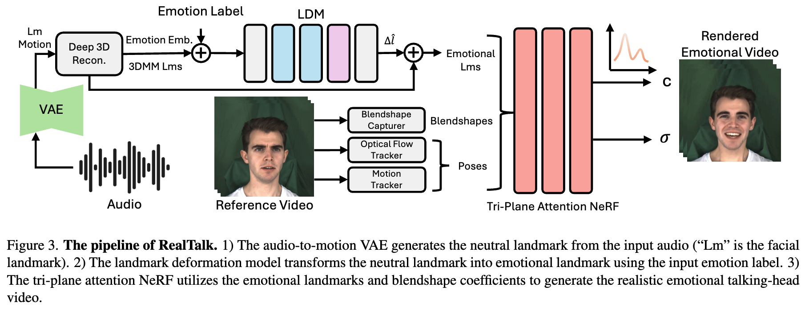

# RealTalk: Realistic Emotion-Aware Lifelike Talking-Head Synthesis

[](https://arxiv.org/pdf/2508.12163) | [](https://wnqw.github.io/RealTalk/)  

<p align="center">
    <br>
    
    <br>
</p>

This repository is for RealTalk framework introduced in the following ICCVW'25 paper:

> **RealTalk: Realistic Emotion-Aware Lifelike Talking-Head Synthesis** \
> [Wenqing Wang](https://wenqing-wang.netlify.app/) and [Yun Fu](https://www1.ece.neu.edu/~yunfu/) \
> Northeastern University 

## Contents
1. [Abstract](#abstract)
2. [Setup](#setup)
3. [Train](#train)
4. [Test](#test)
5. [Citation](#citation)
6. [CustomData](#customdata)
7. [Acknowledgements](#acknowledgements)

## Abstract
Emotion is a critical component of artificial social intelligence. However, while current methods excel in lip synchronization and image quality, they often fail to generate accurate and controllable emotional expressions while
preserving the subject’s identity. To address this challenge, we introduce RealTalk, a novel framework for synthesizing emotional talking heads with high emotion accuracy, enhanced emotion controllability, and robust identity preservation. RealTalk employs a variational autoencoder (VAE) to generate 3D facial landmarks from driving
audio, which are concatenated with emotion-label embeddings using a ResNet-based landmark deformation model
(LDM) to produce emotional landmarks. These landmarks
and facial blendshape coefficients jointly condition a novel
tri-plane attention Neural Radiance Field (NeRF) to synthesize highly realistic emotional talking heads. Extensive
experiments demonstrate that RealTalk outperforms existing methods in emotion accuracy, controllability, and identity preservation, advancing the development of sociallyintelligent AI systems.

## Setup
- Step 1: Follow the steps in `docs/prepare_env/install_guide.md`, create a new python environment named `emogene`, and download 3DMM files into `deep_3drecib/BFM`.

- Step 2: Download the MEAD dataset from [here](https://wywu.github.io/projects/MEAD/MEAD.html) and follow steps in `docs/process_data` to process it, and place it here `data/binary/videos/MEAD/trainval_dataset.npy`.
```bash
bash scripts/process_data.sh
```

## Train
```bash
bash scripts/train.sh
```
Please refer to details in `docs/train_and_infer`.

## Test
Supported emotion: angry, disgust, contempt, fear, happy, sad, surprise, neutral
```bash
bash scripts/infer.sh
```

## CustomData
Please refer to details in  `docs/process_data` and `docs/train_and_infer`.

## Citation
If our work or code helps you, please consider to cite our paper. Thank you!
```
@article{wang2025realtalk,
  title={RealTalk: Realistic Emotion-Aware Lifelike Talking-Head Synthesis},
  author={Wang, Wenqing and Fu, Yun},
  journal={arXiv preprint arXiv:2508.12163},
  year={2025}
  }
```

## Acknowledgments
In this code we refer to the following codebase: [SyncTalk](https://github.com/ZiqiaoPeng/SyncTalk.git), [GeneFace++](https://github.com/yerfor/GeneFacePlusPlus.git), [GeneFace](https://github.com/yerfor/GeneFace.git). We gratefully thank the authors for their wonderful works.